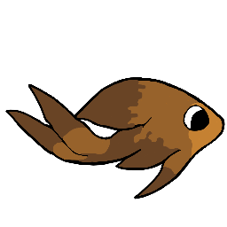
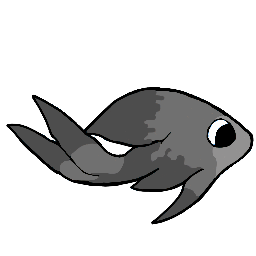
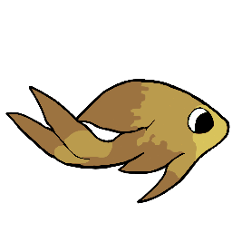
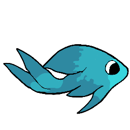
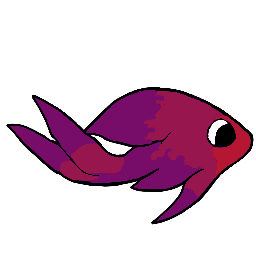

# OMT Color Mapper Examples

The `omt-color-mapper` tool maps colors from one palette to another while preserving perceptual color distances using the OKLab color space.

## Example: Fish Character Variants

This example demonstrates how to create different color variants of a character sprite by mapping from a source palette to various target palettes.

### Available Palettes

| Bronze (Source) | Silver | Gold | Diamond | Ruby |
|-----------------|--------|------|---------|------|
|  |  |  |  |  |

## Color Mapping Examples

### Silver Variant

Command:
```bash
omt-color-mapper map --source-pal pal-bronze.png --target-pal pal-silver.png --input fiiish-bronze.png --output fiiish-silver.png
```

| Source | Palette | Result |
|--------|---------|--------|
|  |  |  |

### Gold Variant

Command:
```bash
omt-color-mapper map --source-pal pal-bronze.png --target-pal pal-gold.png --input fiiish-bronze.png --output fiiish-gold.png
```

| Source | Palette | Result |
|--------|---------|--------|
|  |  |  |

### Diamond Variant

Command:
```bash
omt-color-mapper map --source-pal pal-bronze.png --target-pal pal-diamond.png --input fiiish-bronze.png --output fiiish-diamond.png
```

| Source | Palette | Result |
|--------|---------|--------|
|  |  |  |

### Ruby Variant

Command:
```bash
omt-color-mapper map --source-pal pal-bronze.png --target-pal pal-ruby.png --input fiiish-bronze.png --output fiiish-ruby.png
```

| Source | Palette | Result |
|--------|---------|--------|
|  |  |  |

## Batch Generation

See `generate-fish-variants.sh` for a script that generates all variants at once.
